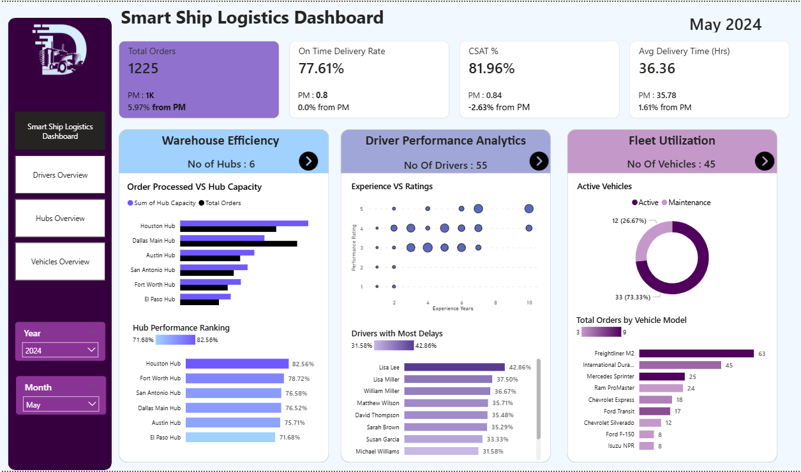
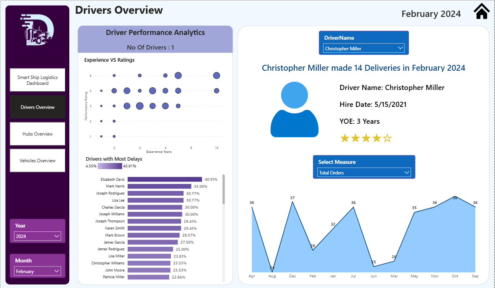
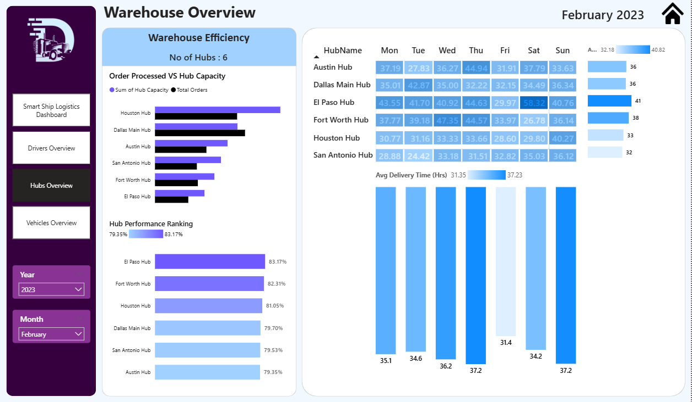
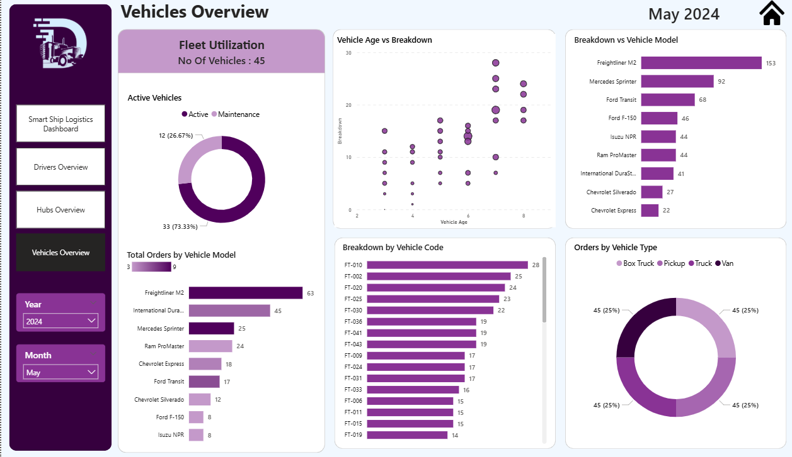

# Smart Ship Logistics Analytics — Power BI Dashboard

---

## What You Are Looking At

This is a 4-page interactive Power BI dashboard built to monitor and 
analyze logistics operations for a shipping company called Smart Ship.
The data covers driver performance, warehouse hub efficiency, fleet 
utilization, and overall order delivery metrics — all filterable by 
year and month through slicers on every page.

The goal was simple. Take 30,000 order records spread across 5 tables 
and turn them into something a logistics manager could actually use 
to make decisions.

---

## Dashboard Pages — Click to Navigate

The dashboard has 4 pages. Each page is linked below with a preview.

---

### Page 1 — Smart Ship Logistics Dashboard (Main Overview)

This is the landing page. It gives you the full picture at a glance.

In May 2023, the company processed 1,233 total orders with an on-time 
delivery rate of 79.71% and a customer satisfaction score of 84.83%.
The average delivery time was 35.64 hours.

All three sections of the business sit side by side here:-

- Warehouse Efficiency shows all 6 hubs ranked by performance.
  Houston Hub leads at 81.16% and Fort Worth sits at the bottom at 77.42%

- Driver Performance Analytics shows 55 drivers plotted by experience 
  vs ratings. John Wilson had the highest delay rate at 44.44%

- Fleet Utilization shows 45 vehicles where 33 (73.33%) are active 
  and 12 (26.67%) are under maintenance. Freightliner M2 handles 
  the most orders at 62

Use the Year and Month slicers on the left to filter everything on 
this page simultaneously.

---

### Page 2 — Drivers Overview

This page drills into individual driver performance.

In February 2024, the dashboard tracked 1 driver at a time using the 
DriverName slicer. For example, Christopher Miller made 14 deliveries 
in February 2024, was hired on 5/15/2021, has 3 years of experience 
and holds a 4-star performance rating.

The left panel shows all drivers ranked by delay rate. Elizabeth Davis 
had the highest delay rate at 40.91% followed by Mark Harris at 35%.
The experience vs ratings scatter plot shows that higher experience 
does not always mean better ratings — which is an interesting finding 
in itself.

The line chart on the right tracks monthly order volume for the 
selected driver across the full year so you can spot consistency 
or decline over time.

Use the DriverName dropdown to switch between all 55 drivers instantly.
Use Year and Month slicers to narrow down the time period.

---

### Page 3 — Hubs Overview

This page focuses entirely on the 6 warehouse hubs.

In February 2023, El Paso Hub ranked first in performance at 83.17%
followed by Fort Worth Hub at 82.31%. Austin Hub sat at the bottom 
at 79.35%.

The day-wise breakdown table on the right shows orders processed per 
hub for every day of the week — Monday through Sunday. El Paso Hub 
processed 41 orders that month, the highest among all hubs.

The average delivery time chart at the bottom shows daily fluctuation 
ranging from 31 hours on the low end to 37 hours on the high end 
across the week.

This page is useful for spotting which hubs are consistently 
underperforming and on which specific days the load is heaviest.

Use the Year and Month slicers to compare hub performance across 
different time periods.

---

### Page 4 — Vehicles Overview

This page covers all 45 vehicles in the fleet.

In May 2024, 33 vehicles were active and 12 were under maintenance.
Freightliner M2 handled 63 orders, the highest of any vehicle model,
followed by International Durastar at 45 and Mercedes Sprinter at 25.

The Vehicle Age vs Breakdown scatter plot shows older vehicles tend 
to have higher breakdown counts — which helps prioritize which 
vehicles to replace first.

Orders are split equally across vehicle types — Box Truck, Pickup, 
Truck and Van each account for 25% of total orders.

The breakdown by vehicle code table on the right lets you identify 
exactly which individual unit is causing the most maintenance issues.

Use the Year and Month slicers to compare fleet health across periods.

---

## Data Model Behind the Dashboard

The dashboard is built on 5 tables connected through a star schema:-

Orders Table :- 30,000 rows, 15 columns — the central fact table
containing every order with delivery time, delay status, CSAT score,
driver, hub and vehicle information

Drivers Table :- 55 rows, 6 columns — driver profiles with experience,
hire date, employment type and performance rating

Hubs Table :- 6 rows, 3 columns — warehouse hub names and capacities

Vehicles Table :- 45 rows, 8 columns — vehicle model, age, type,
breakdown count and maintenance alerts

Date Table :- 730 rows, 7 columns — custom date table used for all
time intelligence calculations

4 relationships connect Orders to Drivers, Hubs, Vehicles and the 
Date Table. 26 DAX measures were written including Month-on-Month 
calculations for orders, CSAT, on-time delivery rate and average 
delivery time.

---

## Key Metrics at a Glance

Total Orders processed :- 1,233 (May 2023)
On Time Delivery Rate :- 79.71%
Customer Satisfaction Score :- 84.83%
Average Delivery Time :- 35.64 hours
Total Drivers :- 55
Total Hubs :- 6
Total Vehicles :- 45 (33 active, 12 in maintenance)
Highest performing hub :- El Paso Hub at 83.17%
Highest delay driver :- John Wilson at 44.44%
Most used vehicle :- Freightliner M2 with 63 orders

---

## Tools Used

Power BI Desktop, DAX, Power Query, Data Modelling, Star Schema Design

---

## Files in This Repository

Smart-Ship-Logistics-Analytics.pbix :- Full working Power BI file
Logistics_analytics_overview.png    :- Main dashboard screenshot
drivers_overview_dashboard.png      :- Drivers page screenshot
hubs_overview_dashboard.png         :- Hubs page screenshot
Vehicles_overview_dashboard.png     :- Vehicles page screenshot

---

## What I Learned Building This

Working with 30,000 order rows across 5 tables taught me that the 
hardest part of analytics is not making charts — it is making sure 
the relationships between tables are clean enough that every number 
you see is actually trustworthy.

The most interesting finding was that driver experience and 
performance rating had almost no correlation. Some of the most 
experienced drivers had the highest delay rates. That is not 
something you see without actually sitting with the data.
